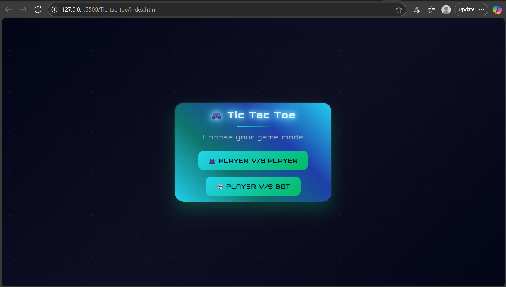
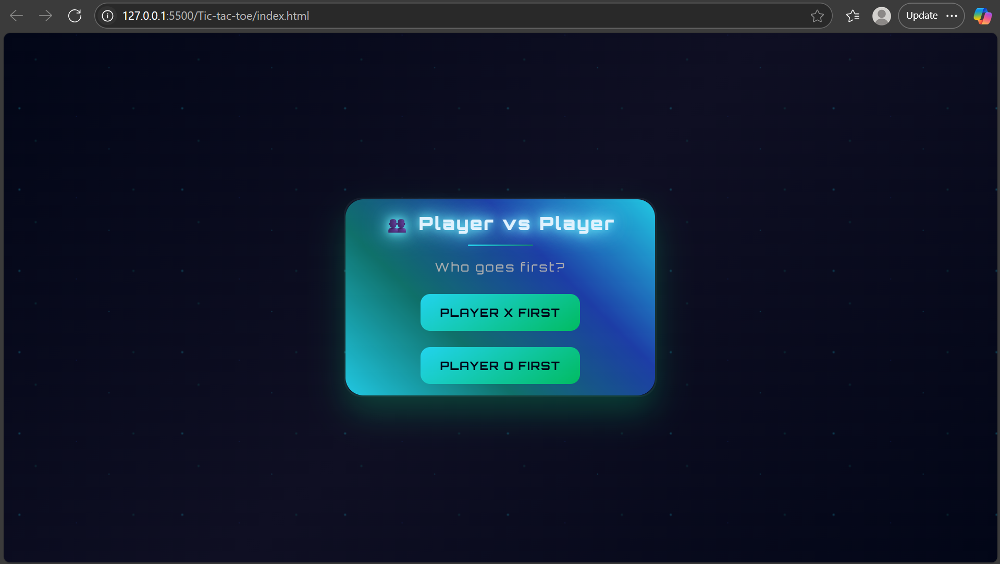
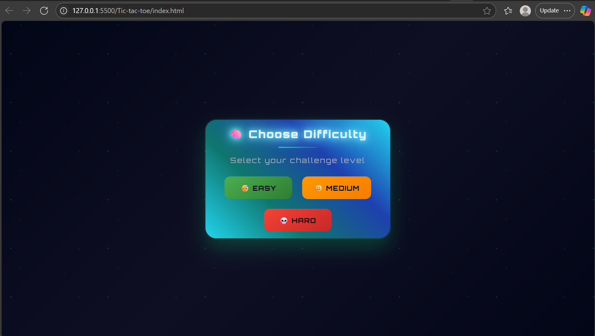
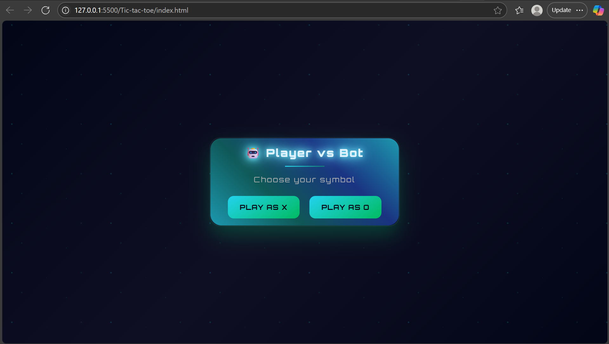
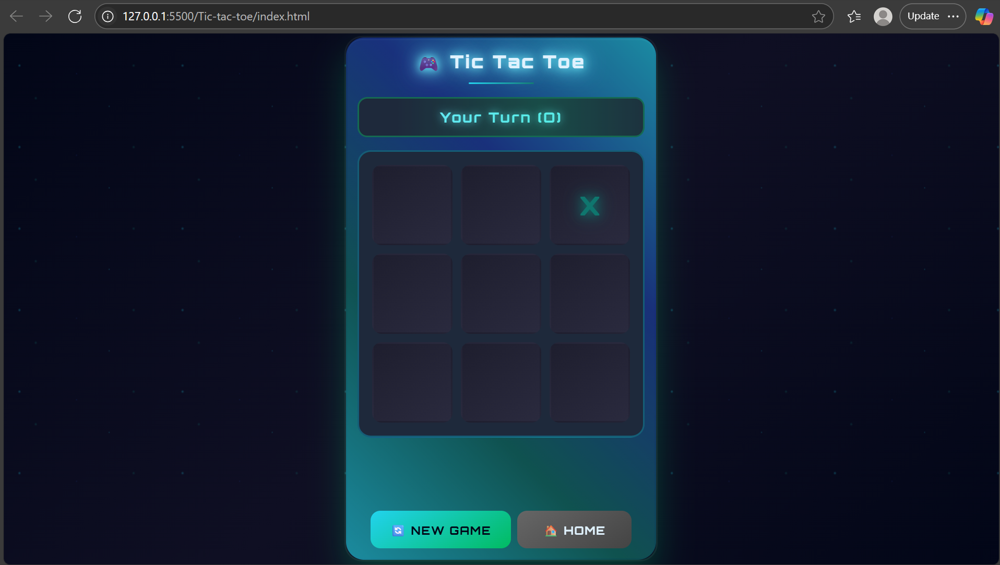

# 🎮 Tic Tac Toe - Ultimate Edition

Welcome to the most feature-packed and troll-fueled version of Tic Tac Toe. This isn't your average 3x3 grid — it's a _battle of wits, roast, and AI supremacy_.

---

## 🚀 Features

- 🧑‍🤝‍🧑 _PvP Mode_ – Classic 2-player mode, but spiced up with transitions and responsive UI.
- 🤖 _Bot Mode_ – Choose from 3 difficulties:
  - _Easy_: The bot is dumber than your old Nokia.
  - _Medium_: Bot thinks one step ahead like a decent player.
  - *Hard: Built with **Minimax Algorithm, this bot plays **perfectly. You can only *draw it, never beat it.
- 🎭 _Roasting System_ – The game mocks you with savage messages depending on your difficulty choice. Easy players beware!
- ⚡ _Glitch Screen Effects_ – Unique loading glitch between screens for a stylish transition.
- 🔊 _Sound Effects_:
  - Click & hover sounds for buttons.
  - Win/Lose sound effects.
- 🎨 _Neon-Cyberpunk Styling_ – Responsive layout with glowing effects and animations.

---

## 🧠 How It Works

### 🕹 Modes

- On launch, select a game mode:
  - PvP: Pick who starts and begin.
  - Bot: Select difficulty → choose to play as X or O.

### 🧠 AI Logic

- _Medium Bot_: Uses getBestMove() to try winning or blocking one move ahead.
- _Hard Bot: Uses recursive \*\*Minimax_ algorithm to evaluate all possible outcomes. It never makes a mistake.

### 🔄 Reset Behavior

- Reset clears the board, sounds, and reinitializes game logic.
- If it's the bot’s turn after reset, it will auto-move after a 1s delay.

---

## 🛠 Tech Stack

- _HTML5_
- _CSS3_
- _JavaScript (Vanilla)_
- No frameworks. Pure JS power.

---

## 📸 Preview







---

## 🚀 How to Run

**1. Clone the repository**

```bash
git clone https://github.com/Ravishashi07/ultimate-tictactoe.git
cd ultimate-tictactoe
```

**2. Right-click on index.html → Open with Live Server OR use the "Go Live" button in VS Code's status bar**

**3. Start playing.**

---

## 📜 License

_MIT License_  
Use it, modify it, roast your friends with it.

---

## 👑 Author

Built with caffeine, sarcasm, and late-night coding.

> “The game where you can lose to a JavaScript object.”

---

## 🌐 Live Demo

[Click here](https://ultimate-tictactoe-plus.vercel.app/)

---

## 🎧 Credits

_Click Sound Effect_  
“Sci-fi Click” by Mixkit  
License: Free for commercial and personal use – No attribution required

_Home Sound Effect_  
"Sci Fi Confirmation" by Mixkit  
License: Free for commercial and personal use – No attribution required

_Loading Sound Effect_  
"Sharp Riser Cinematic Sound FX (No Copyright)"  
by The Audio Horizon SFX  
📎 [YouTube](https://youtu.be/rzci8hFWaDI) | 🌐 [Website](https://www.theaudiohorizon.com)  
License: Royalty-Free – Safe for commercial and personal projects

_Glitch Sound Effect_  
"Best GLITCH Sound FX / Royalty Free"  
by The Audio Horizon SFX  
📎 [YouTube](https://youtu.be/xYuK2xrWsn8) | 🌐 [Website](https://www.theaudiohorizon.com)  
License: Royalty-Free – Safe for commercial and personal projects

_Win Sound Effect_  
"Success 1" by Leszek_Szary  
📎 [Freesound.org Link](https://freesound.org/people/Leszek_Szary/sounds/171671)  
License: Creative Commons 0 (CC0) – No attribution required

_Lose Sound Effect_  
"FAIL funny lose sound effect no copyright"  
by _MNC Music No Copyright_  
📎 [YouTube](https://youtu.be/lU45-HTnWlY)  
Licensed under [Creative Commons Attribution 4.0](https://creativecommons.org/licenses/by/4.0/)

---
